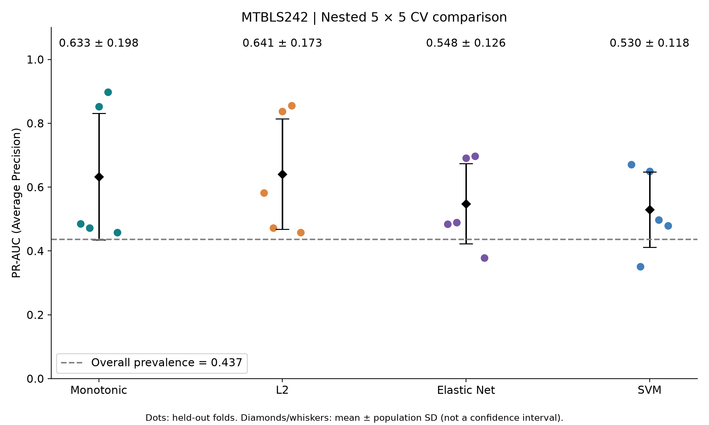

# Compare Monotonic vs L2 vs Elastic Net vs SVM

ผลการทดลอง MTBLS242: ใช้ serum NMR ก่อนผ่าตัด 21 ตัวแปร เพื่อพยากรณ์ strong metabolic response ที่ 12 เดือน ในผู้ป่วย 71 คน (responder 31 คน)

## ผลหลัก

| Model | Mean fold PR-AUC (AP) ± SD | Difference vs Monotonic | Folds better than Monotonic |
|---|---:|---:|---:|
| L2 | 0.641 ± 0.173 | +0.008 | 1 / 5 |
| Monotonic | 0.633 ± 0.198 | Reference | — |
| Elastic Net | 0.548 ± 0.126 | −0.085 | 1 / 5 |
| SVM (RBF) | 0.530 ± 0.118 | −0.103 | 2 / 5 |

SD คำนวณแบบ population (ddof=0) เพื่อสอดคล้องกับรายงานเดิม เป็นความแปรปรวนระหว่าง folds ไม่ใช่ช่วงความเชื่อมั่น ส่วน prevalence รวมเท่ากับ 0.437 (ราย fold เท่ากับ 0.467, 0.429, 0.429, 0.429, 0.429)

L2 มีค่าเฉลี่ยสูงสุด แต่สูงกว่า Monotonic เพียง 0.008 และได้เปรียบเพียง fold เดียว จึงยังไม่มีหลักฐานเพียงพอว่าเปลี่ยนเป็น L2 แล้วผลจะดีขึ้นอย่างสม่ำเสมอ ส่วน Elastic Net และ SVM มีค่าเฉลี่ยต่ำกว่า Monotonic ในการทดลองนี้ ไม่ได้หมายความว่าโมเดลเหล่านี้ด้อยกว่าในทุกชุดข้อมูลหรือทุกการตั้งค่า



## การประเมินและการป้องกันข้อมูลรั่ว

- Target เดิมทุกประการ: metabolites อย่างน้อย 9 จาก 11 ตัวเปลี่ยนในทิศทางที่กำหนด ณ 12 เดือน ตรวจเทียบ label และ improved-marker count กับไฟล์ผลเดิมแล้ว
- Outer stratified 5-fold, seed 42: รายชื่อผู้ป่วยตรงกับการทดลองเดิม และตรงกันทั้ง 4 โมเดล แต่ละคนได้คะแนน held-out ครั้งเดียว
- Inner stratified 5-fold, seed 42 + outer-fold number: ใช้สมาชิกชุดเดียวกันทุกโมเดลใน outer fold นั้น
- log1p เป็นการแปลงแบบตายตัว ไม่เรียนรู้จากข้อมูล ส่วน StandardScaler เรียนรู้เฉพาะ training partition ของแต่ละ inner fit แล้วนำไปใช้กับ validation partition
- ไม่มีการคัดตัวแปรจากข้อมูลทั้ง cohort: ใช้ 21 metabolites ที่ระบุไว้ตายตัว และตรวจว่าข้อมูลครบทุกตัวแทนการกรองจาก future values
- Elastic Net เลือกตัวแปรแบบ embedded โดย shrink coefficients ภายใน training fits เท่านั้น ปรับ lambda และ l1_ratio ผ่าน inner validation AP แล้ว refit บน outer training set
- เลือกพารามิเตอร์ด้วย mean inner AP; ถ้าเสมอเลือก grid entry แรกตามลำดับที่ประกาศไว้ เมื่อเลือกแล้วจึง fit ใหม่บน outer training set และประเมิน outer test เพียงครั้งเดียว
- ไม่มี SMOTE, class weighting, threshold optimization หรือ probability calibration เพิ่มเติม
- PR-AUC ใช้ `sklearn.metrics.average_precision_score` ซึ่งรวมคะแนนที่เสมอกันอย่างถูกต้องและใช้ step integral; ไม่ใช่ trapezoidal area

## โมเดลและขอบเขตการค้นหา

Monotonic และ L2 ใช้ objective เดียวกัน: mean logistic loss + lambda/2 × squared coefficient norm โดยไม่ penalize intercept คำนวณด้วย L-BFGS-B และตรวจ convergence ต่างกันเฉพาะ sign bounds (8 บวก / 3 ลบ / 10 อิสระ) จึงแยกผลของ constraints ได้ชัดเจน

| Model | Inner search grid |
|---|---|
| Monotonic | lambda = 0.001, 0.01, 0.1, 1, 10 |
| L2 | lambda = 0.001, 0.01, 0.1, 1, 10 |
| Elastic Net | lambda เหมือนข้างต้น × l1_ratio = 0.1, 0.5, 0.9; SAGA solver |
| SVM RBF | C = 0.01, 0.1, 1, 10, 100 × gamma = scale, 0.01, 0.1 |

Elastic Net ใช้ C = 1/(n_train × lambda) เพื่อสอดคล้องกับ mean-loss convention ข้างต้น ทุก fit ต้อง converge มิฉะนั้นโปรแกรมหยุด จำนวน inner fits รวม 1,000 และ outer refits 20 ครั้ง

## การอ่านผลเทียบกับงานเดิม

ใช้ mean outer-fold AP เป็นตัวชี้วัดหลัก เพื่อเปรียบเทียบการจัดลำดับผู้ป่วยภายในชุดทดสอบเดียวกัน SVM ส่งออก decision margin ซึ่งไม่ใช่ probability และสเกลคะแนนจากโมเดลคนละ fold อาจต่างกัน

ไฟล์ summary มี pooled OOF AP เพื่อความโปร่งใส: Monotonic 0.565, L2 0.590, Elastic Net 0.476, SVM 0.439 แต่ค่านี้เป็น descriptive เพราะนำคะแนนจากโมเดล 5 ตัวมารวมจัดลำดับกัน ไม่ใช้เป็นเกณฑ์เลือกผู้ชนะ โดยเฉพาะ SVM

ค่า Monotonic เดิม 0.671 เป็น pooled OOF AP ภายใต้ inner **4-fold** และ projected-gradient solver เดิม รอบนี้ใช้ inner **5-fold**, converged L-BFGS-B และ tie-aware AP โดยคง target, outer split และ constraint signs เดิม จึงไม่ควรอ้างว่าค่าเฉลี่ยรอบนี้เพิ่ม/ลดจาก 0.671 โดยตรง

การเลือกโมเดลที่มี outer mean สูงสุดแล้วรายงานคะแนนนั้นอาจยังมี selection bias จึงเพิ่มผลอีกชุดที่ **เลือกทั้งชนิดโมเดลและพารามิเตอร์ภายใน inner folds เท่านั้น**: mean outer AP ของขั้นตอนเลือกโมเดลนี้เท่ากับ **0.564** (เลือก Elastic Net ใน folds 1–4 และ L2 ใน fold 5) ดู `Results/nested_model_selection.csv`

## ข้อจำกัด

มีเพียง 71 คนและการแบ่งข้อมูลหนึ่ง seed; training sets ระหว่าง folds ซ้อนทับกัน จึงไม่ใช้ SD/√5 เป็น confidence interval และไม่อ้าง statistical significance ของอันดับโมเดล ต้องตรวจความเสถียรด้วย repeated nested CV หรือ cohort ภายนอกต่อไป

Target 9/11 เป็นเกณฑ์เพื่อการทดลอง ไม่ใช่ผลลัพธ์ทางคลินิกที่ผ่านการรับรอง การนิยามการเปลี่ยนแปลงจาก baseline ซึ่งเป็น input ด้วยอาจสะท้อน mathematical coupling และ regression to the mean ส่วนทิศทาง monotonic เป็นสมมติฐานเรื่องโอกาสดีขึ้น ไม่ใช่หลักฐานเชิงเหตุและผล

## ไฟล์

- [Results/model_summary.csv](Results/model_summary.csv): ตารางคะแนนรวม
- [Results/outer_fold_metrics.csv](Results/outer_fold_metrics.csv): ผลและพารามิเตอร์ที่เลือกในแต่ละ fold
- [Results/heldout_predictions.csv](Results/heldout_predictions.csv): label, subject ID, outer fold และคะแนนทั้ง 4 โมเดล
- [Results/inner_tuning_scores.csv](Results/inner_tuning_scores.csv): คะแนนทุก candidate ทุก inner fold
- [Results/inner_fold_membership.csv](Results/inner_fold_membership.csv): สมาชิก train/validation สำหรับตรวจสอบย้อนหลัง
- [Results/outer_fit_coefficients.csv](Results/outer_fit_coefficients.csv): coefficients ของโมเดลเชิงเส้นที่ fit บน outer training sets
- [Results/protocol_and_checks.json](Results/protocol_and_checks.json): protocol, input hashes, library versions และ checks
- [Results/verification.json](Results/verification.json): ผลตรวจ fold separation, metric, selected parameters และเทียบ L2 กับ sklearn
- [Graph/paired_fold_comparison.png](Graph/paired_fold_comparison.png): เปรียบเทียบผลแบบจับคู่
- [Graph/pr_curves_by_fold.png](Graph/pr_curves_by_fold.png): PR curves แยก fold

## รันซ้ำ

ใช้ Python 3.12 และโครงสร้าง repo เดิม โดยไฟล์ข้อมูลอยู่ใน `MTBLS242_forecast/` และมีผลเดิมใน `outputs_pr_auc/` สำหรับตรวจความตรงกันของ target

```sh
cd "MTBLS242_forecast/Compare Monotonic vs L2 vs Elastic Net vs SVM"
python -m pip install -r requirements.txt
python run_comparison.py
python verify_results.py
```

สคริปต์นี้รันการประเมินและสร้างผลใหม่ใน Results/ และ Graph/ ภายในโฟลเดอร์ Compare เท่านั้น ไม่ได้สร้างโมเดล deployment ที่ train บนผู้ป่วยทั้งหมด
