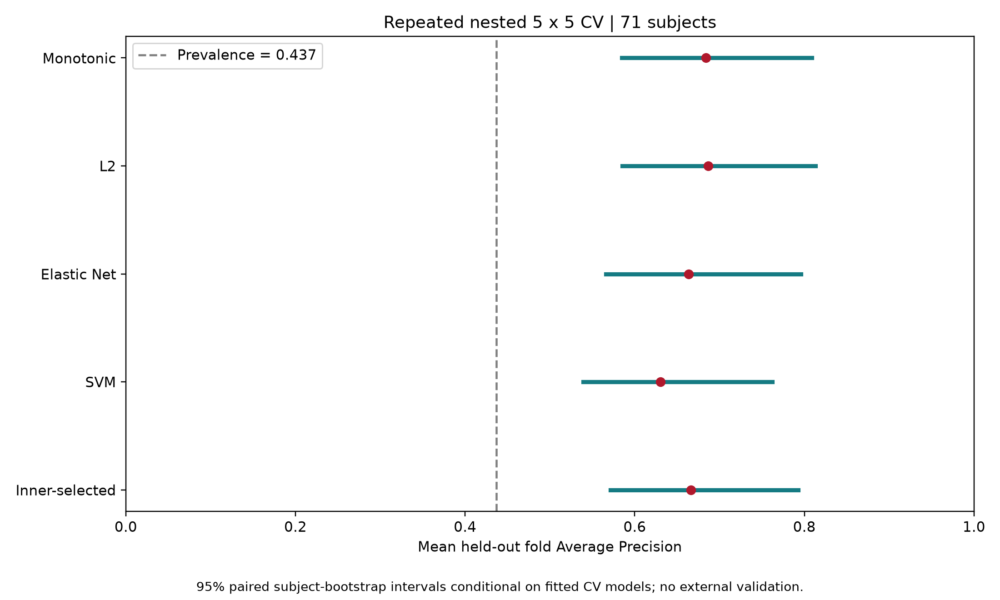
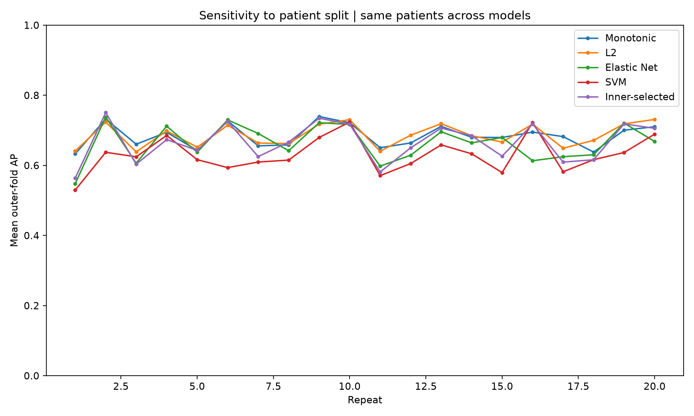

# Repeated nested CV and uncertainty — MTBLS242

Completed: 20 repeats of nested 5 × 5 CV, 2,000 paired subject-bootstrap draws, PNG figures and an independent arithmetic/split audit. **External validation has not been performed. Clinical efficacy is not established.**

## ผลการทดลอง

ใช้ผู้ป่วยเดิม 71 คน (responder 31 คน), 21 metabolites ก่อนผ่าตัด และ target เดิม: สารอย่างน้อย 9 จาก 11 ตัวเปลี่ยนในทิศทางที่กำหนดหลัง 12 เดือน

| Model | Mean outer-fold PR-AUC (AP) | Conditional 95% interval | Difference vs Monotonic | Paired conditional 95% interval of difference |
|---|---:|---:|---:|---:|
| Monotonic | 0.6839 | 0.5850–0.8089 | Reference | — |
| L2 | 0.6864 | 0.5855–0.8133 | +0.0025 | −0.0103–0.0146 |
| Elastic Net | 0.6634 | 0.5659–0.7961 | −0.0205 | −0.0520–0.0133 |
| SVM RBF | 0.6305 | 0.5393–0.7624 | −0.0534 | −0.0806–−0.0142 |
| Inner-selected procedure | 0.6660 | 0.5712–0.7928 | −0.0178 | −0.0356–0.0023 |

L2 และ Monotonic ได้ค่าเฉลี่ยใกล้กันมาก ช่วงของผลต่างคร่อมศูนย์จึงยังไม่มีหลักฐานจากการประเมินนี้ว่า L2 เหนือกว่าอย่างชัดเจน ส่วน SVM มีผลต่ำกว่าในชุดการทดลองนี้ แต่ช่วงดังกล่าวเป็น conditional และไม่ได้ปรับ multiple comparisons จึงไม่ใช้ประกาศความเหนือกว่าระดับประชากรหรือทางคลินิก

Inner-selected หมายถึงเลือกทั้งชนิดโมเดลและพารามิเตอร์โดยดูเฉพาะ inner validation ก่อนประเมิน outer test ผลนี้ใช้ประเมินขั้นตอนการเลือกโมเดลโดยไม่เลือกผู้ชนะจาก outer results แล้วนำคะแนนผู้ชนะมาอ้างซ้ำ





## Evaluation protocol

- 20 outer seeds fixed before these results: 42, 1042, ..., 19042. Each repeat has five stratified, patient-disjoint outer folds; each outer training partition has five inner folds seeded by outer seed + fold number.
- All models use identical inner and outer patients. Training has 56 or 57 patients; outer tests have 15 or 14. Each patient has one outer held-out prediction per model per repeat. Twenty repeats do not create more than 71 independent patients.
- Original target, features, monotonic signs, tuning grids and converged model implementations are retained. `log1p` is fixed; scaler fitting and Elastic Net embedded shrinkage are confined to the respective training partitions. No cohort-wide variable screening or test-set tuning.
- 20,000 inner fits and 400 outer refits. The inner-selected procedure reuses those fits. The separate development-only lock for future external evaluation adds 200 tuning fits.
- Primary statistic: unweighted average of the 100 within-outer-fold AP values per model. Scores from different folds are not pooled to rank patients. SVM margins are never presented as probabilities.
- The first repeat reproduces the preceding single nested-CV experiment. The increase relative to that one seed reflects averaging different partitions, not a new model or proven improvement. Mean AP must not be compared directly with the legacy 0.671 pooled OOF score from the earlier inner-4-fold implementation.

## What the intervals measure

The 95% percentile intervals use 2,000 ordinary bootstrap samples of the **71 original subjects**, seed 20260906. Each subject receives a single multiplicity per bootstrap draw. That same multiplicity applies across all their held-out appearances and all model families. AP is recomputed within each original fold using those multiplicities, then averaged across all 100 folds. Paired differences use exactly the same bootstrap draws.

This preserves repeated-patient pairing and avoids pretending that 100 fold scores are independent. Standard deviation across the 20 repeat means is also provided, solely as split sensitivity; SD/sqrt(100) is not used as a patient-population standard error.

**The models are not retrained during this bootstrap.** Consequently these are approximate **conditional intervals for the saved CV predictions**, not validated 95% population-generalization coverage intervals for the full training algorithm. Shared-training dependence and the uncertainty of fitting a new cohort are not fully captured. Small-fold AP is nonlinear and discrete, so percentile intervals can be biased. Full retraining resampling or suitable CV-inference methods and independent validation remain necessary for stronger population inference. No p-values or clinical significance claims are made.

For a bootstrap-weighted fold containing no positive subjects, AP is defined as zero, consistent with sklearn, and the fixed 100-fold denominator is retained. The count is recorded in `run_checks.json`. Whole-cohort single-class draws are excluded. The overall prevalence 31/71 = 0.437 is a descriptive no-skill reference; PR-AUC depends on prevalence and finite-sample random-ranking AP need not equal that reference exactly.

The reason for avoiding naive independent-fold CIs is supported by [Bengio and Grandvalet (2004)](https://www.jmlr.org/papers/v5/grandvalet04a.html). [Bates, Hastie and Tibshirani, Cross-validation: what does it estimate and how well does it do it?](https://arxiv.org/abs/2104.00673) discusses the inferential target and dependence issue. These references motivate the caveat; the present conditional bootstrap is not claimed to implement their full CV-inference algorithm.

## External and clinical status

See [external candidate screening and locked evaluation protocol](../External_validation/README.md). No eligible independent patient table was available for scoring. The candidate Korean cohort requires an approved request to its investigators. No author contact or data-access application has been submitted.

Target 9/11 remains an experimental metabolic surrogate. Baseline-dependent change can create mathematical coupling and regression to the mean. Repeated CV and a narrow interval would not validate it as a clinical endpoint. A future study needs independent patients, assay comparability, endpoint validation, calibration, decision thresholds and evaluation of clinical utility.

## Files and reproduction

- `summary.csv`: point estimates, conditional intervals and paired differences.
- `repeat_means.csv`: all model results by repeat.
- `subject_bootstrap_draws.csv`: matched draws used for the intervals.
- `repeat_01/` through `repeat_20/`: held-out predictions, fold scores, every inner tuning score and patient membership.
- `protocol.json`: seeds, grids, features, software versions, input/source hashes and interval definition.
- `run_checks.json` and `verification.json`: run checks and independently reconstructed verification.
- `Graph/`: two PNG figures.

From the comparison directory, using the pinned parent requirements:

```sh
python run_repeated.py --repeats 20 --bootstrap 2000
python verify_repeated.py
```

The runner resumes completed repeats only if the stored protocol and byte-level source/data hashes match. For another protocol or platform whose line endings or versions differ, preserve these published outputs separately before starting a fresh run; do not relabel old results. The original comparison and paper files retain their earlier results and have not been rewritten as if they already included this experiment.
